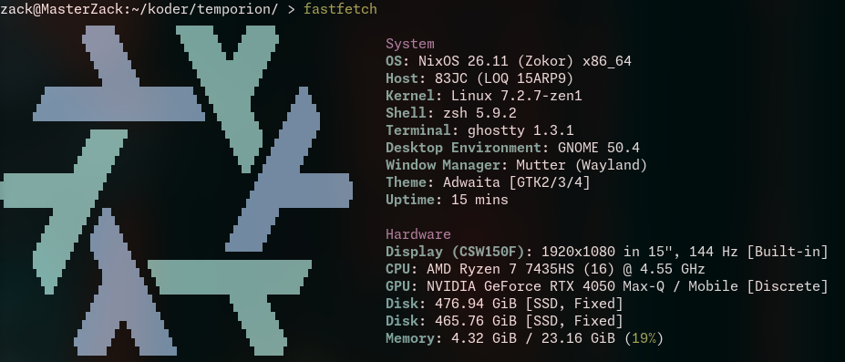

# Temporion

- Freon was a very very good extension for fetching temps, but the sad reality is that it only "was" and not "is"
- So I ~~decided to reinvent the wheel and~~ made temporion (llm did all the job while i was staring at the screen)
- Temporion's pronounciation is like Temp-o-ryan
- I had no wish to spend tokens on providing cross compatibility across systems that might never even use it, So it's designed to run solely on my LOQ 15ARP9
- I use bullet points wherever I want
- Sometimes I accidentally pronounce it as temporeon like vaporeon
# Attaching a fastfetch because why not

